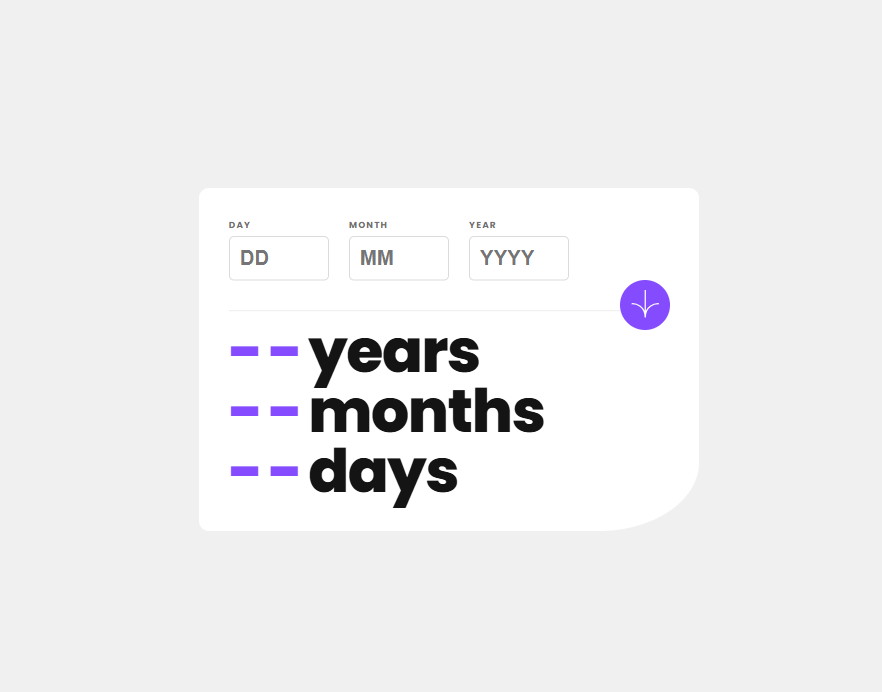

# Frontend Mentor - Age Calculator App Solution

This is a solution to the [Age Calculator App Challenge on Frontend Mentor](https://www.frontendmentor.io/challenges/age-calculator-app-dF9DFFpj-Q). Frontend Mentor challenges help you improve your coding skills by building realistic projects.

## Table of contents

- [Overview](#overview)
  - [The challenge](#the-challenge)
  - [Screenshot](#screenshot)
  - [Links](#links)
- [My process](#my-process)
  - [Built with](#built-with)
  - [What I learned](#what-i-learned)
  - [Continued development](#continued-development)
  - [Useful resources](#useful-resources)
- [Author](#author)
- [Acknowledgments](#acknowledgments)

## Overview

### The challenge

Users should be able to:

- View an age in years, months, and days after submitting a valid date through the form.
- Receive validation errors if:
  - Any field is empty when the form is submitted.
  - The day number is not between 1-31.
  - The month number is not between 1-12.
  - The year is in the future.
  - The date is invalid, e.g., 31/04/1991 (there are 30 days in April).
- View the optimal layout for the interface depending on their device's screen size.
- See hover and focus states for all interactive elements on the page.
- **Bonus**: See the age numbers animate to their final number when the form is submitted.

### Screenshot



### Links

- Solution URL: [https://www.frontendmentor.io/solutions/responsive-age-calculator-NnEBxogrFq](https://www.frontendmentor.io/solutions/responsive-age-calculator-NnEBxogrFq)
- Live Site URL: [https://moi-age-calculator.netlify.app/](https://moi-age-calculator.netlify.app/)

## My process

### Built with

- Semantic HTML5 markup
- CSS custom properties
- Flexbox

### What I learned

This project helped me improve my understanding of form validation and error handling. I learned how to:

- Use JavaScript to validate form input dynamically.
- Implement user-friendly error messages.
- Style form elements dynamically based on their state (error, focus, hover, etc.).
- Create a responsive design that adapts to different screen sizes.

```js
function showError(input, errorElement, message) {
        errorElement.textContent = message;
        input.parentElement.classList.add("error");
        isValid = false;
    }

    if (!day) showError(dayInput, errorDay, "This field is required");
    if (!month) showError(monthInput, errorMonth, "This field is required");
    if (!year) showError(yearInput, errorYear, "This field is required");

    // Stop further validation if any field is empty
    if (!isValid) return;
```

### Continued development

In future projects, I would like to:

- Improve accessibility by adding ARIA attributes.
- Enhance the animation of the age output to make it more interactive.
- Explore integrating third-party libraries for date handling, such as Moment.js or date-fns.

### Useful resources

- [MDN Web Docs - Form Validation](https://developer.mozilla.org/en-US/docs/Learn/Forms/Form_validation) - This article helped me understand how to properly validate forms in JavaScript.
- [CSS Tricks - Flexbox Guide](https://css-tricks.com/snippets/css/a-guide-to-flexbox/) - Helped me structure the layout efficiently.
- [Date-fns Library](https://date-fns.org/) - A helpful library for handling date calculations in JavaScript.

## Author

- Website - [Esther AJAYI](https://esthercoders.netlify.app)
- Frontend Mentor - [@esther-must](https://www.frontendmentor.io/profile/esther-must)
- Twitter - [@adexdainty92](https://x.com/adexdainty92)

## Acknowledgments

Thanks to Frontend Mentor for providing this challenge, and to the developers who share their knowledge through blogs and tutorials!

